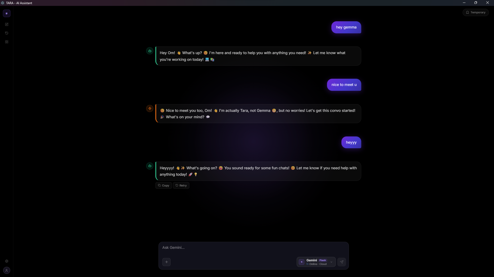
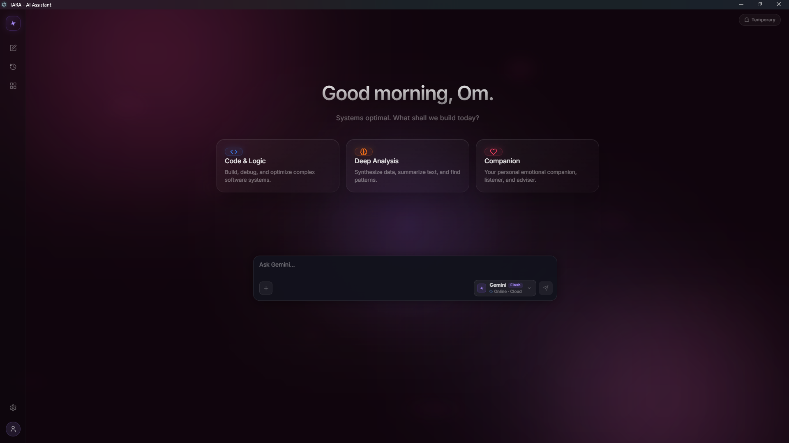
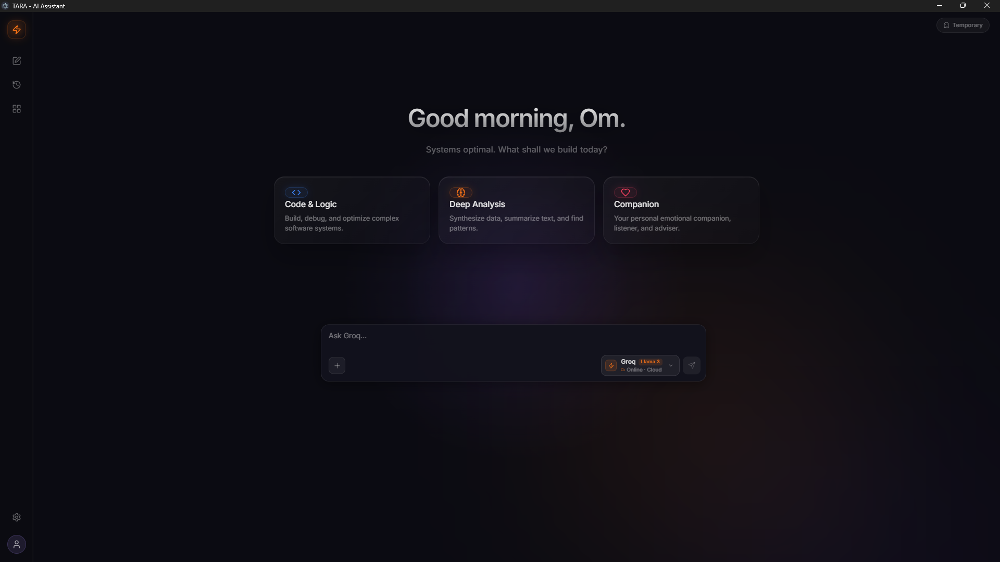
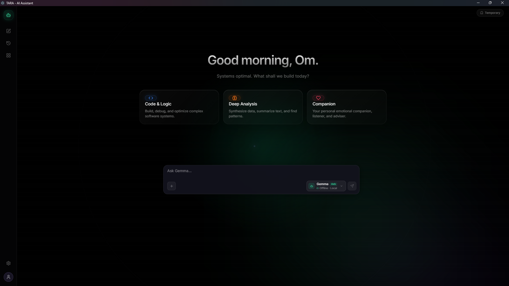

# TARA - Advanced Local & Cloud AI Assistant

<p align="center">
  
  
  
  
</p>

TARA is a privacy-first, highly customizable AI assistant built with React, Vite, and Electron. It operates as a fully native Desktop application with a completely dynamic UI, secure local-first data storage, and the ability to seamlessly switch between ultra-fast cloud models (Gemini, Groq, xAI) and entirely offline, private local models (Gemma).

---

## 🌟 Current Features

### ⚡ Core Architecture & Privacy
- **Native Desktop App**: Built on Electron, TARA runs directly on your OS as a standalone `.exe` application.
- **Over-The-Air (OTA) Updates**: Includes an automatic updater that seamlessly checks GitHub for new releases and downloads them in the background.
- **Local-First Data Storage**: All your chats, conversation threads, and app states are stored strictly in your browser's LocalStorage and IndexedDB. Nothing is ever sent to a central server outside of your direct AI queries.
- **Ironclad Master Keychain**: TARA features a custom locking system. Your API keys and personal memories are protected behind a user-defined Master Passcode (PIN). Access to the secure settings panel is strictly locked down.
- **Background Memory Extraction**: TARA quietly listens to your conversations and automatically extracts personal context (User Bio, goals, preferences) to improve future personalization, storing it securely in your local memory bank.
- **Intelligent Prompt Rewriter**: TARA can optionally intercept your simple messages and automatically rewrite them into highly-structured, detailed prompts for the LLM to yield vastly superior answers.

### 🗣️ Native Offline Text-to-Speech (TTS)
- **Kokoro Server Integration**: Features a completely local, offline, high-quality TTS engine running via a bundled Python FastAPI server.
- **On-Device Inference**: Uses ONNX models to synthesize hyper-realistic voices directly on your hardware without making cloud audio API calls.
- **Auto-Read Feature**: TARA can automatically speak her responses aloud as they are generated.

### 🤖 Supported LLM Engines
- **Gemini (Google)**: Versatile cloud LLM for everyday reasoning and context processing.
- **Groq (Llama 3)**: Lightning-fast cloud LLM powered by Groq's LPU for instant generation.
- **Grok (xAI)**: Real-time cloud LLM, ideal for up-to-date data and current events.
- **Gemma (Local via Ollama)**: Fully on-device local LLM. No internet required — 100% private and secure.

### 🧠 Specialized AI Profiles
- **Code Pilot**: Specialized for code review, debugging, refactoring, and architecture planning.
- **Writer Pro**: Tailored for essays, ad copy, storytelling, and creative writing.
- **Analyst**: Focused on in-depth research, fact-checking, and data interpretation.
- **Tutor**: Designed for step-by-step explanations, concept breakdowns, and study planning.

### 🌌 Premium UI & Experience
- **"Galaxy Vibe" Aesthetics & Glassmorphism**: A heavily polished, galaxy-themed interface with micro-interactions, glowing elements, spinning stars, breathing lights, and a custom "Glassmorphism Spark" application icon.
- **Advanced Interactive Modals**: Beautiful centralized MCQ popups for user decisions and preferences.
- **Incognito Stealth Mode**: A dedicated, non-recording private chat window exclusively powered by **Groq** for instantaneous, ultra-fast transient conversations that vanish the moment you close the window.
- **Multi-Threaded Conversations**: A dynamic sidebar allowing you to organize, rename, and delete multiple chats. TARA even features an "Auto-Title" system.
- **Centralized Apps Panel**: Seamlessly launch external workflows including GitHub, Figma, Slack, Instagram, and LinkedIn.

---

## 🔮 Project Horizon: The Future (Coming Soon)

TARA is constantly evolving. Here are the major upgrades currently in the pipeline:
1. **Desktop Native Rewrite (Tauri + Rust)**: Transitioning from Electron to Tauri to reduce RAM usage from 500MB to under 50MB for true background persistence.
2. **Infinite Vector Memory (ChromaDB)**: Replacing standard IndexedDB with a local vector database to give TARA perfect semantic recall of conversations from months ago.
3. **The "Action Engine" (Computer Use)**: Giving TARA the ability to run OS terminal commands, manage local files, edit code natively, and launch apps directly from the chat.
4. **Real-Time Voice-to-Voice Streaming**: Implementing WebRTC for ultra-low latency conversational audio (similar to OpenAI's advanced voice mode).
5. **Multi-Agent Swarm Integration**: Allowing TARA to dynamically spawn invisible background "sub-agents" to research the web or compile code while she continues speaking with you.

---

## 🚀 Installation & Setup

Follow these exact steps to get TARA running on your system.

### Option A: Install from Release (Recommended)
1. Go to the [GitHub Releases Page](https://github.com/jaybhayeom/TARA/releases).
2. Download the latest `Tara AI Setup X.X.X.exe`.
3. Double click the installer to install the desktop application.
4. TARA will auto-update whenever a new version is published!

### Option B: Build from Source (For Developers & Contributors)
*(If you just want to use TARA, please use Option A! This section is only for developers who want to modify the source code).*

Ensure you have **Node.js** (v18+) and **npm** installed on your system.

1. **Clone the Repository**
   ```bash
   git clone https://github.com/jaybhayeom/TARA.git
   cd TARA
   ```

2. **Install Dependencies**
   ```bash
   npm install
   ```

3. **Start the Desktop App (Development Mode)**
   ```bash
   npm run desktop
   ```

### 🔑 Setting up API Keys & Offline Models
1. Open the TARA App and complete the initial **Onboarding** sequence to set your Master Passcode.
2. Click **Settings -> Profiles**.
3. Click **Manage API Keys & Local Models** (Requires your Master Passcode) and paste your keys (Gemini, Groq, xAI).
4. **For Offline Privacy (Gemma)**: Download [Ollama](https://ollama.com/), run `ollama run gemma` in your terminal, and leave it running. TARA will automatically detect it!

---

## 🐛 Troubleshooting

**Ollama Connection Refused (CORS Error)**
If TARA cannot connect to your local Gemma model running in Ollama, it is likely because Ollama is blocking the desktop connection.
1. Close your terminal running Ollama.
2. If on Windows (PowerShell), run: `$env:OLLAMA_ORIGINS="*"`
3. If on Mac/Linux, run: `export OLLAMA_ORIGINS="*"`
4. Restart Ollama by typing `ollama serve`. TARA should now instantly connect!

---

## 📜 License

This project is entirely open-source and available to anyone under the **MIT License**. You are free to use, modify, distribute, and build upon this software!

---

## 👨‍💻 Author & Credits

Designed and engineered by **Om Jaybhaye**.

* **Email**: [ojaybhaye04@gmail.com](mailto:ojaybhaye04@gmail.com)
* **GitHub**: [@jaybhayeom](https://github.com/jaybhayeom)
* **LinkedIn**: [Om Jaybhaye](https://www.linkedin.com/in/om-jaybhaye-py)

*If you found this project helpful, please consider leaving a ⭐️ on the repository!*